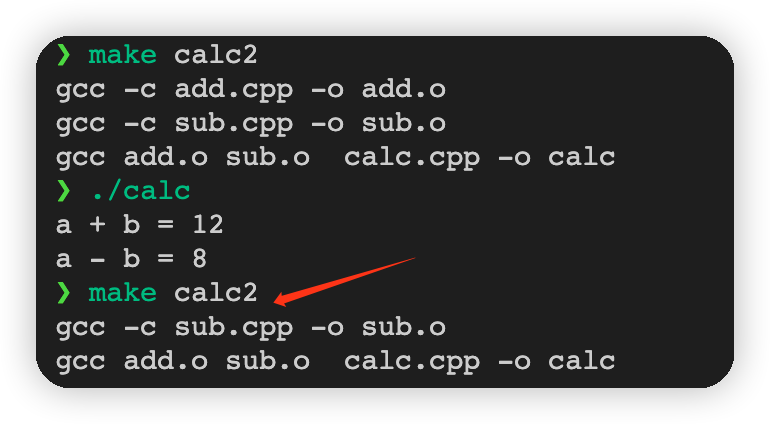

# gcc/g++编译流程

## 编译流程

拆分如下命令：

```shell
gcc -lstdc++ main.cpp
```

过程分为：

- 预处理: `gcc -E main.cpp >main.ii`
- 编译：`gcc -S main.ii` 得到`main.s`汇编文件
- 汇编：`gcc -c main.s` 得到`main.o`二进制文件
- 链接：`gcc -lstdc++ main.o` 得到 a.out 可执行文件

## 避免重复编译未改动的文件

示例文件：

```Makefile
# 全部编译
cal:
	gcc add.cpp sub.cpp calc.cpp -o calc

# 二次编译时，保证只有改动的文件才进行二次编译
calc2:add.o sub.o
	gcc add.o sub.o  calc.cpp -o calc

add.o:add.cpp
	gcc -c add.cpp -o add.o

sub.o:sub.cpp
	gcc -c sub.cpp -o sub.o
```

改动`sub.cpp`文件，再次编译：

